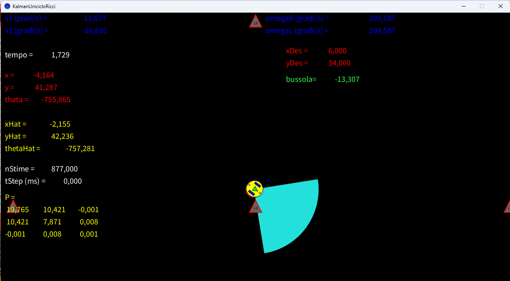
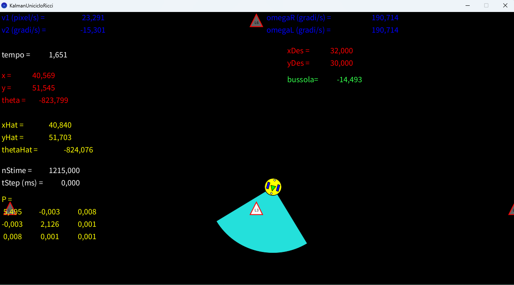

# Unicycle Robot Navigation with Extended Kalman Filter

## Descrizione
Questo progetto simula il controllo di un robot mobile di tipo unicycle in un ambiente 2D, con stima della posa basata su filtro di Kalman esteso (EKF).

La navigazione verso un punto selezionato con il mouse viene effettuata tramite controllo proporzionale, utilizzando però variabili stimate anziché quelle reali.

---

## Obiettivi del progetto
- Simulare un robot mobile di tipo unicycle
- Implementare un controllo in velocità verso un goal selezionato
- Stimare la posa del robot tramite Extended Kalman Filter
- Fondere odometria e misure da landmark
- Analizzare l’effetto della frequenza delle misure sulla stima

## Modello del sistema

Il robot è un **uniciclo** caratterizzato da:
- posizione: (x, y)
- orientamento: θ
- controllo tramite:
  - velocità lineare v
  - velocità angolare ω

---

## Stima della posa (EKF)

La posizione del robot viene stimata tramite:
- odometria (movimento delle ruote)
- misure di distanza da landmark

Il filtro di Kalman esteso restituisce:
- stato stimato: (x̂, ŷ, θ̂)
- matrice di covarianza P

---

## Controllo e interazione

- Click del mouse → definisce il punto obiettivo (xDes, yDes)
- Controllo proporzionale verso il goal basato sulla stima EKF

---

## Controlli tastiera

- ↑ / ↓ → aumenta o diminuisce `tStep` (frequenza delle misure)
- → / ← → raddoppia o dimezza `tStep`
Quando `tStep` è grande, la stima diventa quasi puramente odometrica.

---

## Visualizzazione

Durante la simulazione vengono mostrati:

- posizione reale del robot (rosso)
- posizione stimata EKF (giallo)
- landmark (triangoli con identificativo Li)
- punto obiettivo

---

## Variabili visualizzate

- Stato reale:
  - x, y, θ
- Stato stimato:
  - x̂, ŷ, θ̂
- Covarianza:
  - matrice P
- Controllo:
  - ωR, ωL (velocità ruote)
  - v1 (velocità lineare)
  - v2 (velocità angolare)
- Tempo di campionamento:
  - tStep

---

## Limitazioni: come da specifica

- Ambiente bidimensionale semplificato
- Modello di sensori ideale (rumore non esplicitato nel dettaglio)
- Nessuna dinamica complessa del robot

---

## Autore
Simonetta Ricci

---

## Note
Progetto sviluppato nell’ambito dello studio di robotica mobile, stima dello stato e controllo basato su osservatori.
